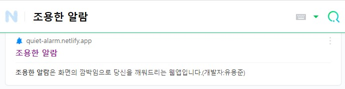

# silent_alarm_app_2021
군복무 당시, 당직실에서 소리가 나는 알람을 맞추고 잘수없어서 직접 만들었다.
화면의 깜빡임으로 깨우는 방식이다.
마음편히 졸거나 티비를 볼 수 있었다.

https://quiet-alarm.netlify.app/

    

Netilfy로 사이트를 만들었으며
현재 네이버에 조용한 알람 검색후 3번째 페이지에 가면 확인할 수 있다.

    

